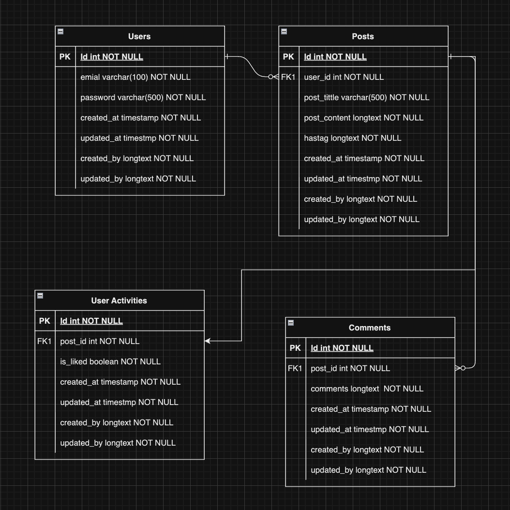

# go_simple_forum

- docker compose up
- docker compose down
- docker compose exec -it local-mysql-db bash
- docker compose exec -it local-mysql-db mysql -u root -p

# ERD

# Migrate

- make create name=create_user_table
- make up
- make down

# Viper

- https://github.com/spf13/viper
- https://github.com/spf13/viper/tree/master/example/ConfigFile

# Golang JWT

- https://github.com/golang-jwt/jwt/v5
- https://pkg.go.dev/github.com/golang-jwt/jwt/v5@v5.0.0/jwt#example-NewWithClaims-CustomClaims

# Zerolog

- https://github.com/rs/zerolog
- https://pkg.go.dev/github.com/rs/zerolog@v1.29.1/log#example-New-consoleWriter
